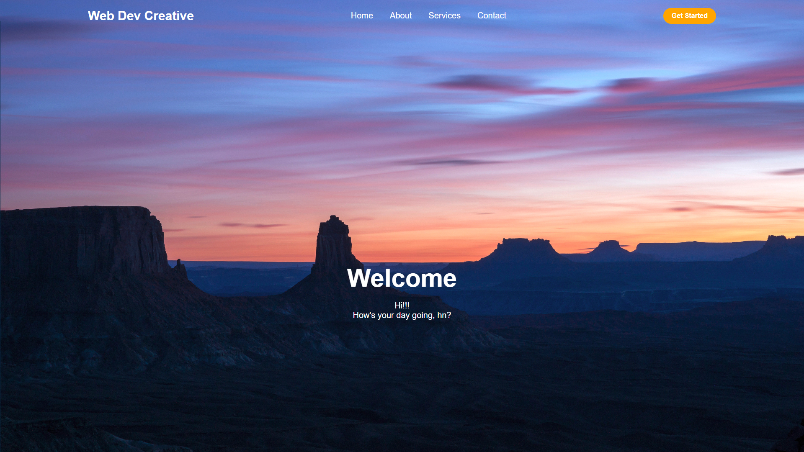

# Responsive Navbar with Glassmorphism

A modern, responsive navigation bar built using HTML, CSS, and Vanilla JavaScript. This project features a sleek design, smooth transitions, and a mobile-friendly dropdown menu with a glassmorphism effect.

## 🚀 Features

- **Responsive Design**: Adapts seamlessly to Desktop, Tablet, and Mobile screens.
- **Glassmorphism UI**: Uses `backdrop-filter: blur()` for a premium modern look on the mobile menu.
- **Interactive Toggle**: Custom hamburger menu animation using Font Awesome icons.
- **Hero Section**: Includes a stunning background with centered typography.
- **Smooth Transitions**: Hover effects and scale animations on buttons for better UX.

## 🛠️ Technologies Used

- **HTML5**: For semantic structure.
- **CSS3**: For custom styling and layout.
- **JavaScript**: For mobile menu toggle logic.
- **Font Awesome**: For high-quality icons.

## 📸 Preview

<details>
  <summary>Click to view project preview</summary>
  <br>
  
  <p align="center"><em>A visual preview of the responsive navbar.</em></p>
</details>

## 📂 Project Structure

```text
.
├── index.html       # Main HTML structure
├── style.css        # Custom styles & Media queries
├── Preview.png      # Project preview image
└── SunsetKiva.jpg   # Background asset
```

## ⚙️ How to Run

1. Clone or download this repository.
2. Open `index.html` in any modern web browser.
3. Resize the window to see the responsive behavior in action!

## 🤝 Contributing

Contributions, issues, and feature requests are welcome! Feel free to check the [issues page](https://github.com/suyashsahu00/responsive-navbar/issues).

---

Developed with 💚 by [Suyash Sahu](https://github.com/suyashsahu00)
